# Execution:

To execute the script using command line, 
1. Change the working directory to this folder
2. Run the `main.py` script
`python3 main.py`


# Summary


## Implemented image classification on House room and real estate images using transfer learning.


a) Obtained a dataset of different room images based on the research paper:
J. H. Bappy, J. R. Barr, N. Srinivasan and A. K. Roy-Chowdhury, "Real Estate Image Classification"

b) Split the image data into train, validation, test sets.

c) Performed resizing and rescaling on data, which is required for Keras models.

d) Performed built-in and custom image augmentations on the data

e) Converted the data into TensorFlow datasets for easier and faster processing, and buffered prefetching for better performance.

f) Implementing transfer learning using 
>1) VGG16
>2) VGG19
>3) ResNet50V2
>4) InceptionV3
>5) ConvNeXtXLarge
>6) EfficientNetV2B0


g) Implemented automated hyperparameter tuning on ResNet50V2

h) Visualized train, validation and test accuracy metrics for each model


# Description

**Dataset Information:**  
J. H. Bappy, J. R. Barr, N. Srinivasan and A. K. Roy-Chowdhury, "Real Estate Image Classification,"
2017 IEEE Winter Conference on Applications of Computer Vision (WACV), Santa Rosa, CA, USA,
2017, pp. 373-381.

Source:   
https://drive.google.com/file/d/0B54qhIps3nofTUNPWmQyME9sbkk/view?resourcekey=0-kW1M0jgidYPtqtyLcz5Qmw

Dataset:  
https://drive.google.com/uc?id=0B761qYXle4lYZHlMQ01rTEtva3M&export=download

**Total number of samples:**  
5859

**Total number of classes:**  
6 (backyard, bathroom, bedroom, frontyard, kitchen, livingRoom)

**Number of samples in each class:**
| Class | Count|
|--|--|
|  backyard  |  745  | 
|  bathroom  |  793  | 
|  bedroom   |  1593 |
| frontyard  |  884  | 
|  kitchen   |  992  | 
| livingRoom |  852  |


**Brief description of the measurements:**
|Measurement| Description | 
|--|--|
| Channels | RGB images of 3 channels |
| Pixel values| Ranging from 0 to 255 |
| Dimensions | Images are of varying dimensions |

**Train, validation, test split ratio**
| Set | Ratio (%) | Number of samples |
|--|--|--| 
|Train|60|3513|
|Validation|20|1169|
|Test|20|1177|

Note: To keep the classes fairly balanced, splitfolders library distributed some images in test and validation sets

**Nature of the group of interest and what differentiates it from the other samples (the group(s) not of interest):**  
The class label of the image, i.e., whether the image is of 'backyard', 'bathroom', 'bedroom', 'frontyard', 'kitchen', or 'livingRoom'.

**Sample of images in dataset**

>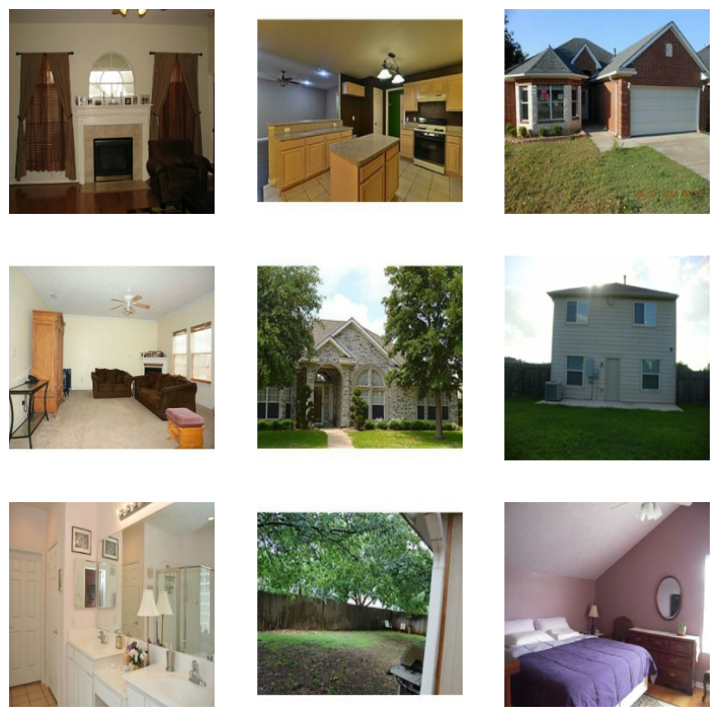

# Detail


## a) Obtained a dataset of different room images based on the research paper:

J. H. Bappy, J. R. Barr, N. Srinivasan and A. K. Roy-Chowdhury, "Real Estate Image Classification"

I procured my dataset from the authors of this research paper. However, the procured dataset does not contain all the images used in the research paper due to copyright concerns, hence I cannot compare my results directly. 
The dataset contains different folders which correspond to the specific class labels ('backyard', 'bathroom', 'bedroom', 'frontyard', 'kitchen', 'livingRoom'), and each of the folders contain their respective images. The images are all 3 channelled RGB colour images of JPEG format, however with varying dimensions. 

## b) Split the image data into train, validation, test sets.

TensorFlow allows splitting data into only train and test sets. For validation purposes, I split the dataset folder beforehand using split-folders library into train, validation, and test sets, in a ratio of 60:20:20.

## c) Performed resizing and rescaling on data, which is required for Keras models.

As the images are of varying dimensions, I resized them into a shape of (224,224,3). This shape was chosen as the default input shape for most of the pre-trained models used is (224,224,3). Similarly, as the images are RGB, each pixel value ranges in [0, 255]. The pre-trained models expect pixel values in the range [0, 1] and hence rescaling was also performed.

Moreover, due to resizing, models also need less compute power to process these images, and hence the model training phase is manageable.


## d) Performed built-in and custom image augmentations on the data

The procured dataset is relatively small for an image classification task. To increase the diversity of the training set, I performed several simple and custom augmentations on the data. These augmentations were applied only to the training set.

The simple augmentations were performed using Keras preprocessing layers include:

>RandomFlip  
>RandomRotation  
>RandomContrast  
>RandomCrop  
>RandomTranslation  
>RandomZoom  
>GaussianNoise  
>RandomBrightness  

The arguments passed to these are such that they do not totally distort the image. For example, as the image was resized to 224x224 shape, the crop was set to 180x180 to retain some information. 

This pipeline was also combined with an Equalization layer from keras_cv to perform Image Histogram equalization, to enhance the contrast of the image.

The following is an example of the simple augmentations and Equalization performed by this pipeline:


>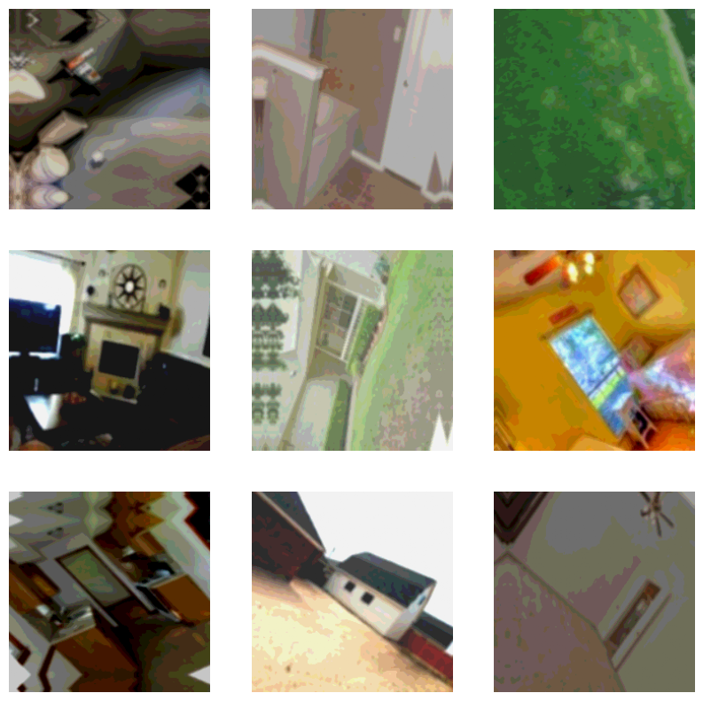


I was suggested by the TA to implement a State-of-the-Art automatic augmentation technique called TrivialAugment, which is parameter free, and extremely fast. But, as the available implementation of TrivialAugment is built on Pytorch, there are compatibility issues which prevent it from being used with tensors in Keras. 

Instead, I used RandAugment, which uses just the sequence of augmentations and the magnitude with which the augmentations will be performed. Due to the extreme accuracy penalty incurred because of RandAugment, and the requirement of longer tuning and training to get noticeable improvements, RandAugment is provided as an additional argument in the ```prefetch_augment_data()``` method, by passing ```rand = True.``` The following is an example of the augmentations performed by RandAugment:  

>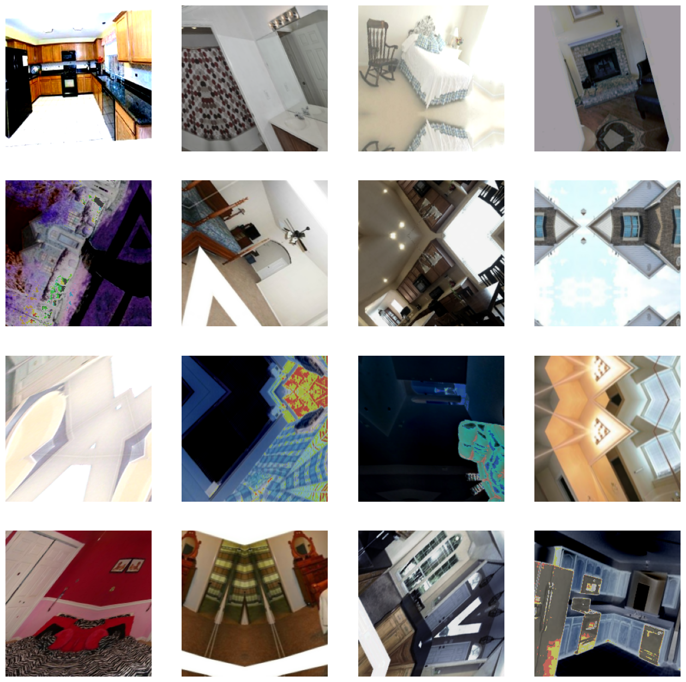

Reference: 

https://www.tensorflow.org/tutorials/images/data_augmentation

https://keras.io/api/layers/preprocessing_layers/image_augmentation/

RandAugment: https://arxiv.org/abs/1909.13719v2

https://stats.stackexchange.com/questions/476678/can-i-use-augmented-data-in-the-validation-set/476679

## e) Converted the data into TensorFlow datasets for easier and faster processing, and buffered prefetching for better performance

To implement the above augmentation layers, I had two options, either to implement these layers in the model itself, or map these augmentations directly to the dataset itself. I chose the latter option as it was the most efficient one for use on a CPU. I also used prefetch methods with ```AUTOTUNE``` in TensorFlow to cache the data on the memory, and ```AUTOTUNE``` provides dynamic allocation based on the available resources, which prevent Out of memory errors.

Another option for me was to use ImageDataGenerator, which would have made it more convenient to parse the dataset folders. However, it does not provide the use of custom augmentation layers like Equalization and RandAugment, and the method is deprecated, hence I manually mapped these layers to my dataset.


https://www.tensorflow.org/tutorials/images/classification#configure_the_dataset_for_performance

https://www.tensorflow.org/guide/data_performance


## f) Implementing transfer learning using:  
>1) VGG16
>2) VGG19
>3) ResNet50V2
>4) InceptionV3
>5) ConvNeXtXLarge
>6) EfficientNetV2B0

For training the data, I chose the above pre-trained models and performed transfer learning. 

As a baseline model, I chose the LeNet-5 CNN model taught to us in the course. The LeNet-5 is a relatively simple CNN model (by modern standards) which was used to classify MNIST digits. I also wanted to see how a model built for single-channel images like digits would work on colour images. Unsurprisingly, the LeNet-5 managed only 27% accuracy over all epochs.

For transfer learning, I used models defined in the ```keras.applications``` API. The layers were freezed to avoid destroying any of the information they contain during future training rounds.

### Common layers
For all pre-trained models, we first initialize all the models by not including the top classification layers. It is because our data has different classification characteristics (eg: number of classes) and we can thus customize these layers according to our needs. An average pooling layer was used after the input layer.

To maximize our performance metric, I added a few dense (fully connected) layers. I added dropout layers after every Dense layer, to provide regularization. These will drop neurons at random and thus prevent overfitting. The number of layers, units and rates for these dense and dropout layers were set by experimentation.

Since we have to classify our images as one of the 6 classes, a dense layer of 6 with a softmax function is added at the last as an output layer.

I also used an EarlyStopping callback to stop training if the val_accuracy showed no improvement while training. I set it to 4 epochs, and if val_accuracy has shown no improvement even after 4 epochs, the training will stop.

### Choice of Metric

Before training, I assumed that F1 score might be the best indicator for our dataset, which is slightly imbalanced. However, I observed that F1 score was always close to 1.0. After reading up, I found out that normal F1 score is best for binary classification, and accuracy as a metric is good enough for multiclass classification. Hence I decided upon accuracy as a metric.

### Choice of Pre-trained model

I also wanted to implement WideResNet-32, however, the official pre-trained implementation of it in TensorFlow is incompatible with newer TensorFlow versions.

https://keras.io/guides/transfer_learning/#build-a-model

https://www.tensorflow.org/guide/keras/transfer_learning

https://stats.stackexchange.com/questions/240305/where-should-i-place-dropout-layers-in-a-neural-network

https://keras.io/api/callbacks/early_stopping/

https://datascience.stackexchange.com/questions/102913/problem-with-using-f1-score-with-a-multi-class-and-imbalanced-dataset-lstm

https://github.com/szagoruyko/functional-zoo/issues/25

## g) Implemented automated hyperparameter tuning on ResNet50V2

Due to compute limits, I wasn't able to perform automated hyperparameter tuning on every model, and performed limited automated hyperparameter tuning using Keras tuner on the ResNet50V2. 

The parameters which were chosen to be tuned were:

* ```hp.Int('units', min_value=32, max_value=512, step=32)```  
    The units for first dense layer
* ```hp.Choice('learning_rate', values=[1e-2, 1e-3, 1e-4]) ```   
    Learning rate value

After this process, the best parameters found were:

* Best number of units:  320
* Best learning rate for the optimizer:  0.001


After finding the optimal hyperparameters, we build the model, and search for at which epoch the best val_accuracy was achieved.

Finally we evaluate the model on test data after training for the best number of epochs.

https://www.tensorflow.org/tutorials/keras/keras_tuner

## h) Visualized train, validation and test accuracy metrics for each model

| Model |Test Accuracy |
| -- | -- |
| LeNet-5 | 0.2718 |
| VGG16 | 0.6975 |
| VGG19 | 0.6567 |
| **ResNet50V2** | **0.8470** |
| InceptionV3 | 0.7570 |
| ConvNeXtXLarge | 0.6491 |
| EfficientNetV2B0 | 0.2718 |
| ResNet50V2 Tuned | 0.8096 |

### LeNet-5  
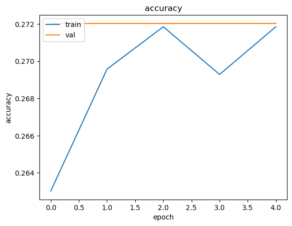  

As expected, LeNet-5 has the lowest accuracy of 27%, owing to it being much smaller and made for single channel, grayscale images.

### VGG16  
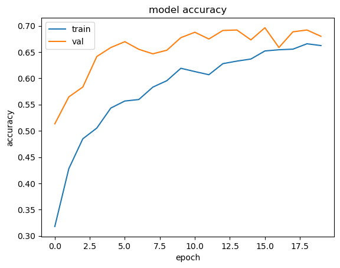  
At 69.75%, and a balanced train and val accuracy, VGG16 seems like a good balanced model.

### VGG19
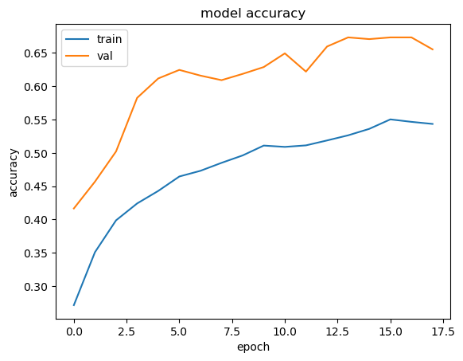  
VGG19 scores 65.67% test accuracy, lower than VGG16. This might be due to overfitting, as VGG19 has 3 more layers than VGG16, hence the name.

### ResNet50V2
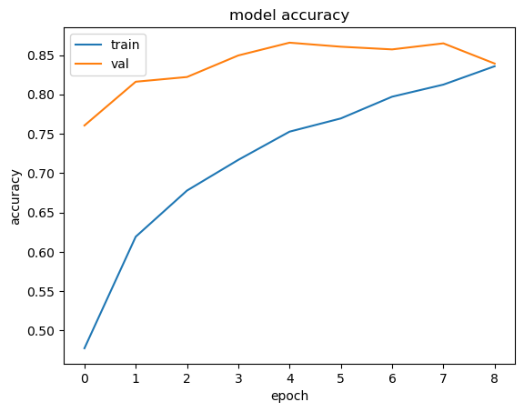  
ResNet50V2 has the best test accuracy at 84.7%, out of all models. Just as train and val accuracies start to meet at epoch 8, the callback is trigerred.

### InceptionV3
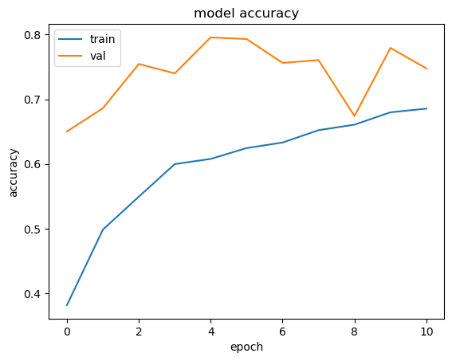  
InceptionV3 had a test accuracy of 75.7%, which is the second best (third if including hyperparameter tuned ResNet) of all models. 

### ConvNeXtXLarge
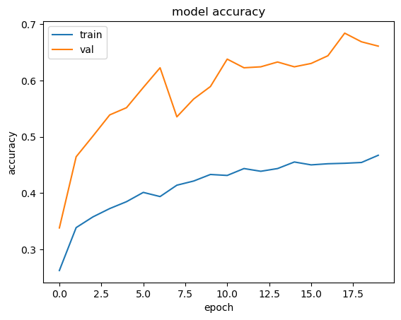  
At 1310MB, ConvNeXtXLarge is the largest pre trained model available in the ```keras.applications``` library.
It isn't the best model out of all, but I wanted to see what such a big model can give. At 64.91%, it isn't the best, and I assume it is because I will need to fine tune a bit more.

### EfficientNetV2B0
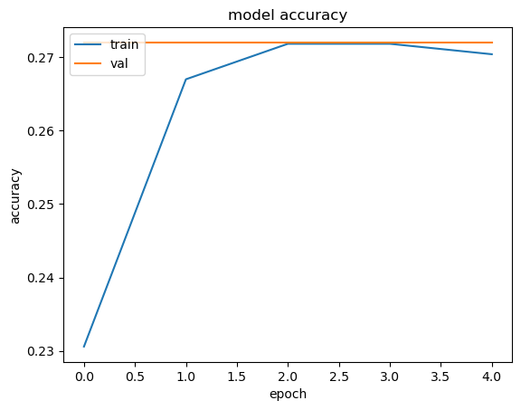  
I was suggested to use EfficientNetV2B0 by the TA, however, I wasn't able to fully utilise this model. It had a flat plateau at 27.18% while training. The Keras documentation corroborates with my findings, that the EfficientNet struggles on smaller datasets with lower resolution images, like ours. I tried to set up preprocess_inputs argument, incase the inputs need to be processed differently, however the low accuracy persisted.

### ResNet50V2 with tuned hyperparameters
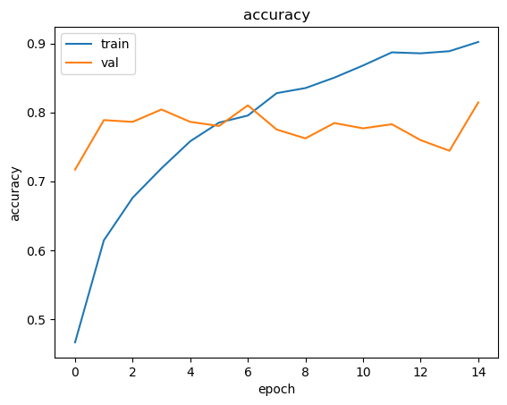  
I wanted to perform hyperparameter tuning on all the models, however compute limits prevented me from doing so.
As the untuned ResNet50V2 had the best test accuracy, I tried performing automated hyperparameter tuning using Keras tuner on it. I was going to use GridSearch at first, but  Keras tuner was much faster.

Using a limited number of parameters to tweak, I performed hyperparameter tuning to get the best parameters and the best epoch as well. In the end, the tuned ResNet achieved test accuracy of 80.96%, lower than the untuned ResNet. From the graph, we can observe that validation accuracy didn't change by much and was lower than train accuracy after 4th epoch.

https://keras.io/examples/vision/image_classification_efficientnet_fine_tuning/#training-a-model-from-scratch

https://www.tensorflow.org/tutorials/keras/keras_tuner

